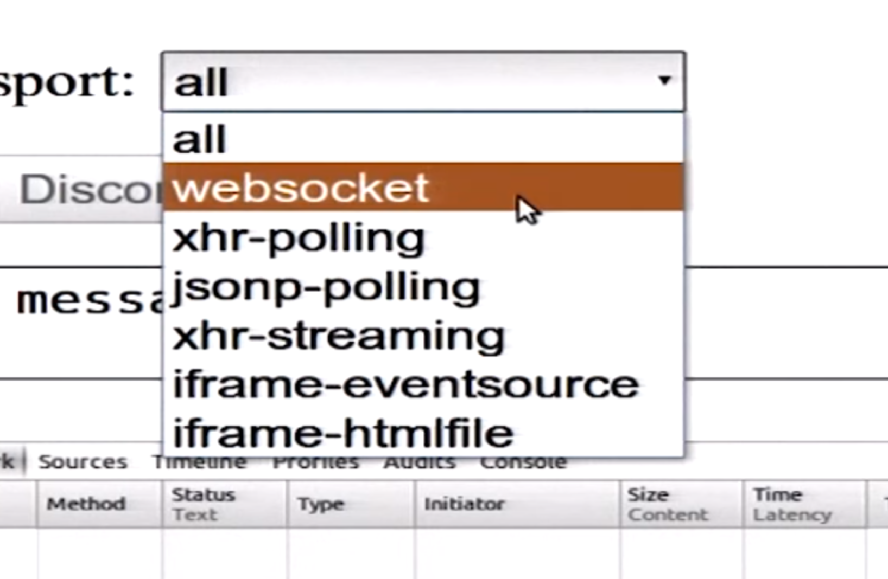
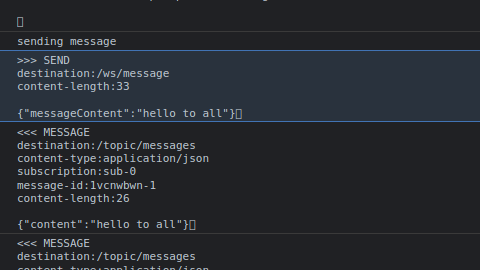
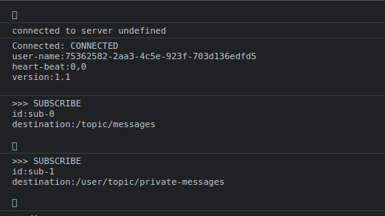

> 2 way connections between client and server which does not rely on multiple http connections.
> Event driven, messaging architecture. 

What is WebSocket ?
> A layer over TCP.
> Full duplex (both parties sending data at the same time), stateful connection. 
> Stream of messages sent rather than bytes.
> HTTP used only for initial handshake.

> ws is the web socket protocol, the use of ws protocol requires client & server to be able to support it.
> sockjs emulates websockets in the sense if the client/server wouldn't support ws it would use any of the fallback mechanisms available.
 

protocol wss is preferred and should be used over ws. (wss stands for secure web socket) is similar to http & https.

STOMP. 

Simple protocol for asynchronous messaging.
Supported by all messaging brokers. (Rabbit MQ, ActiveMQ)

Client to Server Commands.
> Send
> Subscribe
> Unsubscribe

Server to client Commands.
> Message
> Error
> Receipt
> Ack
> Nack

So in short, STOMP defines the rules for communication over websockets.

Check the STOMP documentation page.

STOMP Connect frame has authentication headers.

> How does the communication work ?

> Pre-configuration
> 1. Registering endpoint via java registry.addEndpoint("/random-address")
> 2. Enabling simple broker on prefix "/topic"    
> 3. Application destination prefix "/ws"
> 4. Controller defines the mapping and SendTo. 

> Flow  

> I. Client side  
> 1. Starting a sockjs connection on the defined endpoint (random-address)
> 2. UI action initiates stomp client to make a SEND call to a destination as follows.
 
 
> II. Server side  
> 1. The message is received by the <strong>controller defined for the appropriate destination</strong>
> 2. It is then sent to an address to which the client would have already subscribed as follows: 

> III. Client side  
> 1. Clients who are subscribed to the specific endpoints, receive the message and display it.